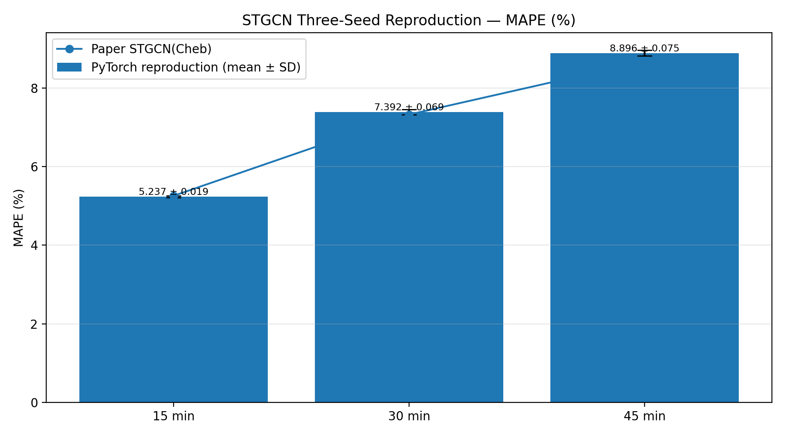

# STGCN PyTorch Reproduction

This repository reproduces the STGCN(Cheb) results from *Spatio-Temporal Graph
Convolutional Networks: A Deep Learning Framework for Traffic Forecasting* on
PeMSD7(M). It starts from the modern PyTorch implementation by
[hazdzz/STGCN](https://github.com/hazdzz/STGCN), then audits the data pipeline,
graph construction, model definition, evaluation procedure, and checkpoint
selection against the authors' TensorFlow implementation.

The repository includes controlled graph-pipeline experiments and results from
three random seeds. See the [reproduction report](docs/REPRODUCTION_REPORT.md)
for the full methodology and the
[gap analysis](docs/REPRODUCIBILITY_GAP_NOTE.md) for the remaining differences.

## Results

The table reports mean and sample standard deviation across seeds 42, 123, and
2026. Checkpoints were selected at epochs 50, 49, and 48, respectively, using
the validation-trigger logic from the original repository.

| Horizon | Paper MAPE | Reproduction MAPE | Paper MAE | Reproduction MAE | Paper RMSE | Reproduction RMSE |
|---|---:|---:|---:|---:|---:|---:|
| 15 min | 5.260% | **5.237 ± 0.019%** | 2.250 | **2.243 ± 0.014** | 4.040 | **4.064 ± 0.014** |
| 30 min | 7.330% | **7.392 ± 0.069%** | 3.030 | **3.052 ± 0.048** | 5.700 | **5.743 ± 0.062** |
| 45 min | 8.690% | **8.896 ± 0.075%** | 3.570 | **3.634 ± 0.078** | 6.770 | **6.856 ± 0.120** |

Detailed tables are available in
[results/multiseed_summary](results/multiseed_summary). The three-seed sample
is intended as a stability check, not a complete statistical study.



## Main findings

- The third-party `adj.npz` contains 19,118 non-zero entries, compared with
  1,664 in the graph distributed with the original STGCN code. Replacing it
  with the official graph substantially reduced the MAE and RMSE gap.
- The modern PyTorch and original TensorFlow GSO constructions differ mainly
  at isolated nodes 13, 135, and 226. Their effect was small relative to the
  adjacency-matrix change.
- The original implementation updates the complete test-metric vector whenever
  any validation metric improves. Reproducing that rule selected different
  checkpoints for two of the three seeds.
- Variation increases with forecast horizon, which is consistent with error
  accumulation during recursive prediction.

The controlled A/B/C comparison is recorded in
[results/graph_ablation_comparison](results/graph_ablation_comparison):

| Experiment | Adjacency matrix | GSO construction |
|---|---|---|
| A | Third-party PyTorch graph | Current PyTorch utility |
| B | Official STGCN graph | Current PyTorch utility |
| C | Official STGCN graph | Original TensorFlow formulation |

## Reproduction protocol

- PeMSD7(M), with 228 sensors sampled every five minutes.
- Original 34/5/5-day train/validation/test split.
- Daily windows that do not cross midnight.
- A single training-set mean and standard deviation for normalization.
- Twelve historical steps and one-step training.
- Nine-step recursive inference, evaluated at 15, 30, and 45 minutes.
- Two ST-Conv blocks with temporal GLU, Chebyshev graph convolution, temporal
  ReLU, and LayerNorm.
- TensorFlow-style `0.5 * sum((prediction - target)^2)` training loss.
- RMSProp with an initial learning rate of 0.001 and a factor of 0.7 every five
  epochs.

## Repository layout

```text
STGCN-reproduction/
|-- model/                  # STGCN layers and the audited model
|-- script/                 # Data loading and graph utilities
|-- experiments/
|   |-- verification/       # Data, graph, model, and protocol checks
|   |-- ablation/           # Controlled graph-pipeline comparison
|   |-- analysis/           # Result tables and figures
|   `-- exploratory/        # Historical one-off diagnostics
|-- results/                # Tracked metrics and selected figures
|-- docs/                   # Methodology and gap analysis
|-- baseline/
|   `-- main.py             # Original third-party PyTorch entry point
|-- paper_main.py           # Audited reproduction entry point
`-- README.md
```

The audited reproduction entry point is `paper_main.py`. The original
third-party PyTorch training entry point is retained as `baseline/main.py` for
comparison.

The files under `experiments/` retain the intermediate checks used during the
audit without presenting them as the main public interface.

## Environment and installation

The reported runs used Python 3.10.11 and PyTorch 2.11.0+cu128 on an NVIDIA
GeForce RTX 5070. Recorded package versions are in `requirements-lock.txt`.

Install a PyTorch build appropriate for the local CUDA environment, then install
the remaining dependencies:

```powershell
pip install -r requirements-no-torch.txt
```

## Running the experiment

The final configuration uses the official adjacency matrix and the original
TensorFlow GSO construction:

```powershell
python paper_main.py --graph_source official --gso_source original --epochs 50 --checkpoint_every 10 --seed 42 --run_name official_original_gso_seed42
python paper_main.py --graph_source official --gso_source original --epochs 50 --checkpoint_every 1 --seed 123 --run_name official_original_gso_seed123_protocol
python paper_main.py --graph_source official --gso_source original --epochs 50 --checkpoint_every 1 --seed 2026 --run_name official_original_gso_seed2026_protocol
```

Analyze the original validation-selection protocol and summarize the final
metrics with module-style commands from the repository root:

```powershell
python -m experiments.verification.analyze_selection_protocol --run_name official_original_gso_seed123_protocol
python -m experiments.verification.evaluate_selected_checkpoint --run_name official_original_gso_seed123_protocol --epoch 49
python -m experiments.analysis.summarize_multiseed_results
```

Checkpoints and smoke-test runs are intentionally excluded from version control.
The repository retains the metrics, configurations, and figures needed to audit
the reported results.

## Attribution

Original paper and TensorFlow implementation:

> Bing Yu, Haoteng Yin, and Zhanxing Zhu. *Spatio-Temporal Graph Convolutional
> Networks: A Deep Learning Framework for Traffic Forecasting.* IJCAI 2018,
> pages 3634-3640.

- [VeritasYin/STGCN_IJCAI-18](https://github.com/VeritasYin/STGCN_IJCAI-18)
- [hazdzz/STGCN](https://github.com/hazdzz/STGCN)

This work independently reproduces, executes, audits, and extends the PyTorch
baseline by aligning it with the original TensorFlow code and conducting
controlled reproducibility experiments. It is not a from-scratch implementation
of the STGCN architecture.

## License

See [LICENSE](LICENSE).
