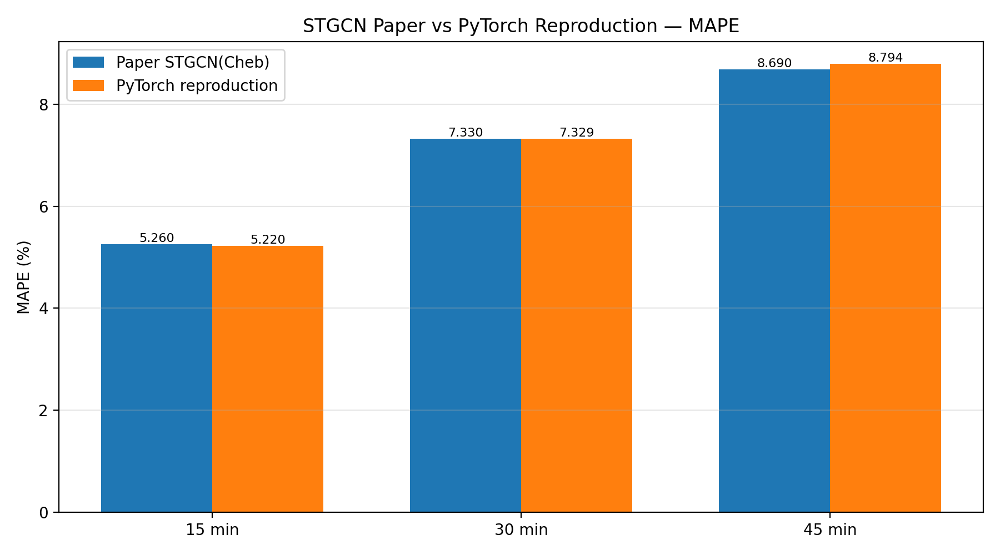
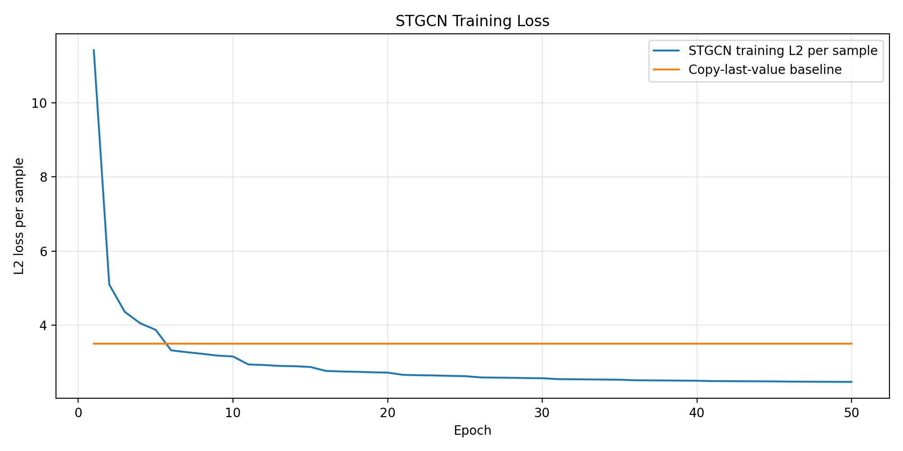

# STGCN Paper-Aligned PyTorch Reproduction

A modern PyTorch reproduction of **Spatio-Temporal Graph Convolutional Networks: A Deep Learning Framework for Traffic Forecasting** by Bing Yu, Haoteng Yin, and Zhanxing Zhu.

This project reproduces STGCN on **PeMSD7(M)** with paper-aligned data processing, model structure, training settings, and autoregressive evaluation at **15, 30, and 45 minutes**.

> Full methodology, implementation notes, experimental analysis, and figures are available in [REPRODUCTION_REPORT.md](REPRODUCTION_REPORT.md).

## Final Results

| Forecast horizon | Paper MAPE | Reproduction MAPE | Paper MAE | Reproduction MAE | Paper RMSE | Reproduction RMSE |
|---|---:|---:|---:|---:|---:|---:|
| 15 minutes | 5.260% | **5.220%** | 2.250 | **2.259** | 4.040 | **4.116** |
| 30 minutes | 7.330% | **7.329%** | 3.030 | **3.093** | 5.700 | **5.848** |
| 45 minutes | 8.690% | **8.794%** | 3.570 | **3.695** | 6.770 | **7.001** |

The reproduced results closely match the reported **STGCN(Cheb)** results, especially at the 15- and 30-minute horizons.





## What Was Aligned

- CSV loading with `header=None`, preserving all 12,672 observations.
- Original 34-day / 5-day / 5-day train-validation-test split.
- Daily sliding windows that never cross midnight.
- One global training-set mean and standard deviation for Z-score normalization.
- One-step training with nine-step autoregressive inference.
- Evaluation at recursive steps 3, 6, and 9: 15, 30, and 45 minutes.
- Two ST-Conv blocks with paper-aligned channel settings.
- Temporal GLU, Chebyshev graph convolution, temporal ReLU, and LayerNorm.
- RMSProp optimizer and learning-rate decay by `0.7` every five epochs.
- Fixed 50-epoch training schedule with dropout disabled.

## Dataset

**PeMSD7(M)** contains traffic-speed observations from 228 road sensors sampled every five minutes.

| Property | Value |
|---|---:|
| Sensors | 228 |
| Sampling interval | 5 minutes |
| Total duration | 44 days |
| Time points per day | 288 |
| Full data shape | `(12672, 228)` |
| Training sequences | 9,112 |
| Validation sequences | 1,340 |
| Test sequences | 1,340 |

Each complete sequence contains 12 historical time steps and nine future time steps:

```text
12 historical steps + 9 future steps = 21 time steps
```

## Forecasting Strategy

The model learns a one-step task:

```text
Previous 12 observations (60 minutes) → next observation (5 minutes)
```

At inference time, every prediction is appended to the input window and fed back into the same model:

```text
Step 3 → 15-minute forecast
Step 6 → 30-minute forecast
Step 9 → 45-minute forecast
```

## Model Architecture

```text
Input: [batch, 1, 12, 228]

ST-Conv Block 1:
1 → 32 → 32 → 64
Output shape: [batch, 64, 8, 228]

ST-Conv Block 2:
64 → 32 → 32 → 128
Output shape: [batch, 128, 4, 228]

Output Block:
Output shape: [batch, 1, 1, 228]
```

Each paper-aligned ST-Conv block uses:

```text
Temporal GLU
→ Chebyshev graph convolution
→ ReLU
→ Temporal ReLU
→ LayerNorm
```

The paper-aligned model contains **333,604 trainable parameters**.

## Training Configuration

| Setting | Value |
|---|---:|
| Historical steps | 12 |
| Maximum recursive steps | 9 |
| Temporal kernel size | 3 |
| Spatial kernel size | 3 |
| Batch size | 50 |
| Epochs | 50 |
| Optimizer | RMSProp |
| Initial learning rate | 0.001 |
| LR schedule | ×0.7 every 5 epochs |
| Dropout | 0 |
| Random seed | 42 |

The training loss follows TensorFlow's `tf.nn.l2_loss` convention:

```text
0.5 × sum((prediction - target)²)
```

## Repository Structure

```text
STGCN-reproduction/
├── model/
│   └── paper_model.py              # Paper-aligned STGCN architecture
├── script/
│   └── dataloader.py               # Paper-aligned data preparation
├── results/
│   └── paper_full_50epochs/         # Metrics, history, figures, and config
├── paper_main.py                    # Formal training and evaluation entry point
├── 16_analyze_results.py           # Result tables and plots
├── REPRODUCTION_REPORT.md           # Full reproduction report
├── requirements-lock.txt            # Recorded environment versions
└── requirements-no-torch.txt        # Dependencies excluding PyTorch
```

The numbered scripts `01_...py` to `15_...py` document and verify the data pipeline, tensor shapes, temporal convolution, graph convolution, autoregressive setup, optimizer configuration, and exact paper-aligned model structure.

## Environment

The formal experiment was run with:

| Component | Version / Device |
|---|---|
| Operating system | Windows |
| Python | 3.10.11 |
| PyTorch | 2.11.0+cu128 |
| GPU | NVIDIA GeForce RTX 5070 |
| NumPy | 1.22.4 |
| Pandas | 1.4.3 |
| SciPy | 1.10.1 |
| Matplotlib | 3.7.5 |

PyTorch should be installed separately using a build suitable for the local GPU and CUDA environment. The remaining recorded dependencies are available in `requirements-no-torch.txt` and `requirements-lock.txt`.

## Run the Experiment

Activate the virtual environment and enter the repository:

```powershell
D:\spatiotemporal-ml\.venv-stgcn\Scripts\Activate.ps1
cd D:\spatiotemporal-ml\STGCN_reproduction
```

Run a one-epoch smoke test:

```powershell
python paper_main.py --epochs 1 --run_name smoke_test
```

Run the complete 50-epoch experiment:

```powershell
python paper_main.py --epochs 50 --run_name paper_full_50epochs
```

Generate comparison tables and figures:

```powershell
python 16_analyze_results.py
```

Formal outputs are stored in:

```text
results/paper_full_50epochs/
```

Local model checkpoints are stored in:

```text
checkpoints/paper_full_50epochs/
```

Checkpoint files are excluded from Git by `.gitignore`.

## Branches

- `main`: preserved modern PyTorch baseline.
- `paper-aligned`: final paper-aligned implementation and formal reproduction results.

## Reproduction Notes

This implementation is not expected to be bitwise identical to the original TensorFlow 1 code. Small differences can result from framework internals, parameter initialization, floating-point operations, CUDA kernels, and library versions. Nevertheless, the reproduced metrics closely follow the paper's reported behavior and performance.

## Original Work and Attribution

Paper:

> Bing Yu, Haoteng Yin, and Zhanxing Zhu.  
> *Spatio-Temporal Graph Convolutional Networks: A Deep Learning Framework for Traffic Forecasting.*  
> IJCAI 2018, pages 3634–3640.

Original authors' repository: [VeritasYin/STGCN_IJCAI-18](https://github.com/VeritasYin/STGCN_IJCAI-18)

The initial modern PyTorch baseline in this repository was based on [hazdzz/STGCN](https://github.com/hazdzz/STGCN), and was subsequently extended with paper-aligned data preparation, autoregressive evaluation, model internals, formal experiments, and analysis.

```bibtex
@inproceedings{yu2018stgcn,
  author    = {Yu, Bing and Yin, Haoteng and Zhu, Zhanxing},
  title     = {Spatio-Temporal Graph Convolutional Networks: A Deep Learning Framework for Traffic Forecasting},
  booktitle = {Proceedings of the 27th International Joint Conference on Artificial Intelligence},
  pages     = {3634--3640},
  year      = {2018}
}
```

## License

See [LICENSE](LICENSE).