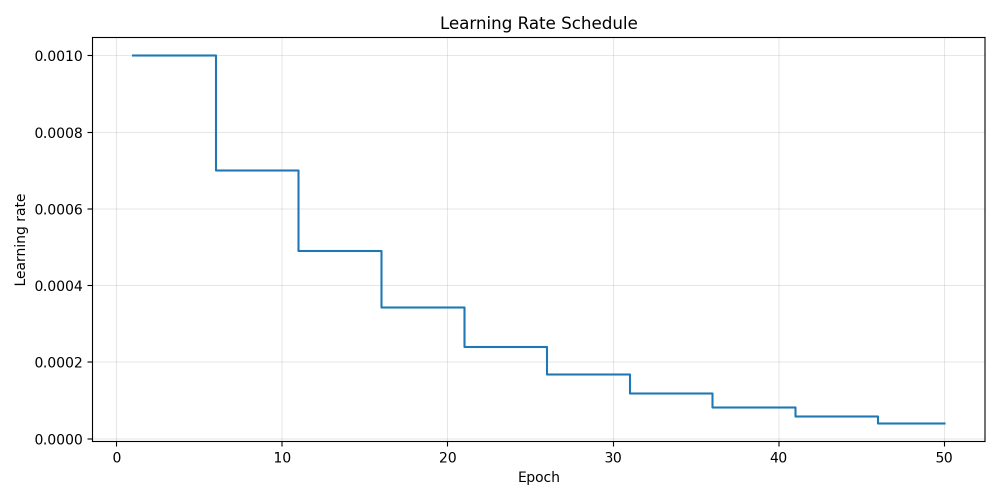
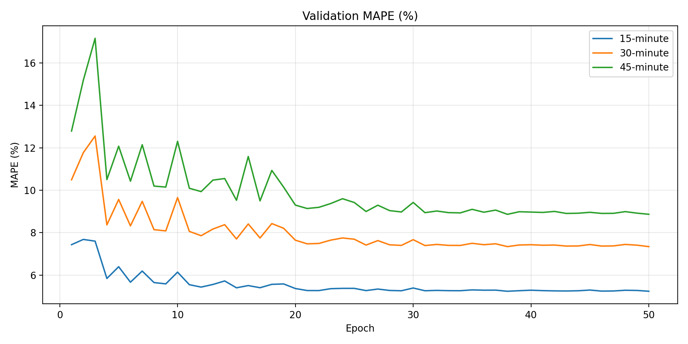
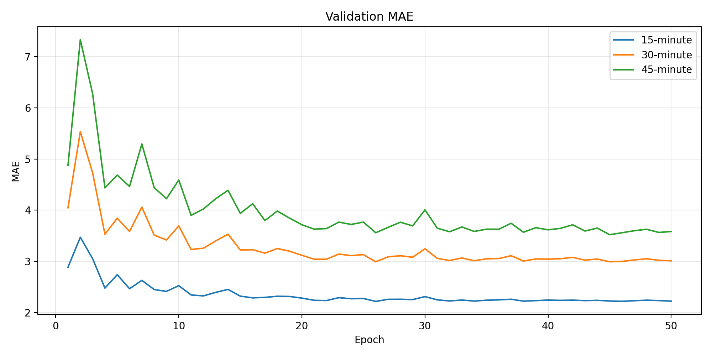
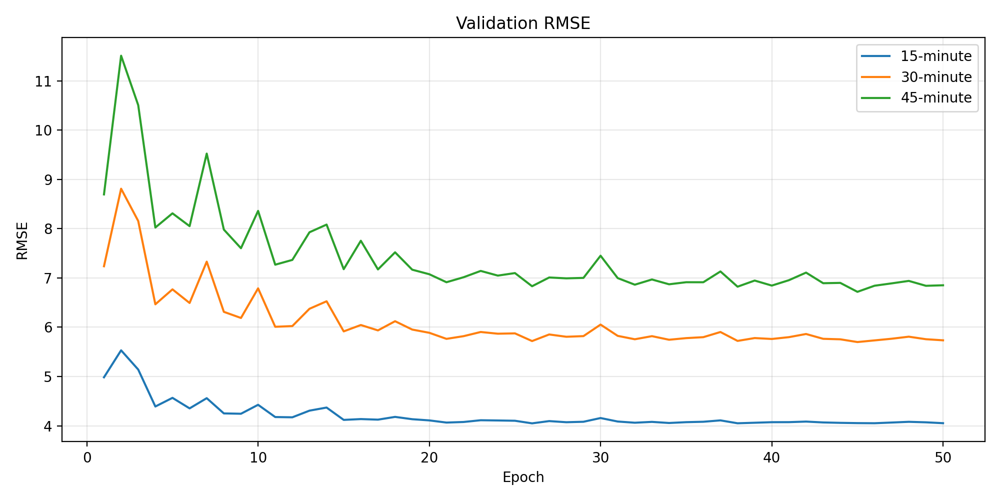
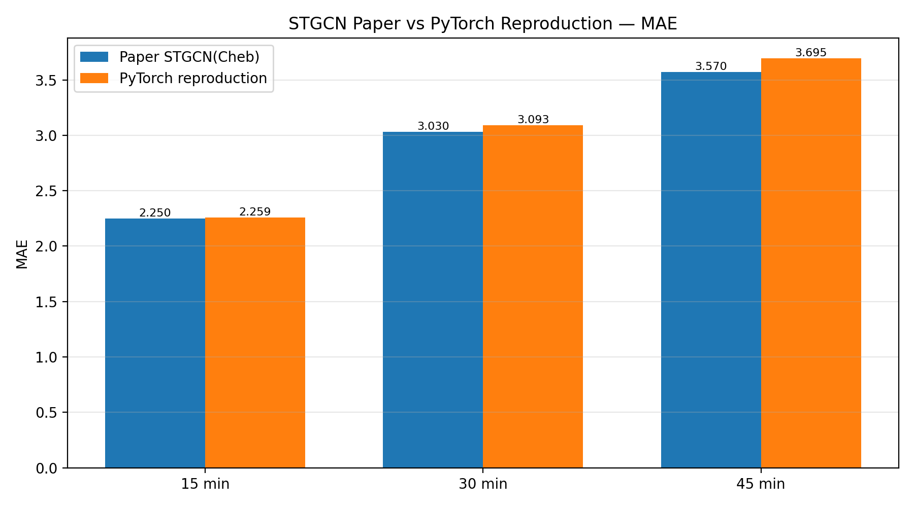
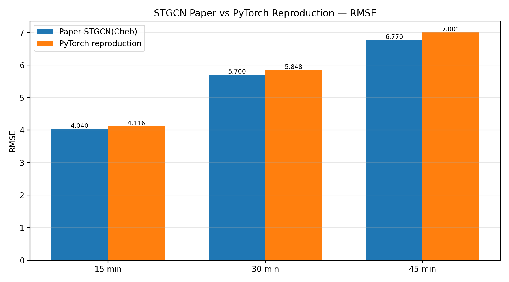

# STGCN Paper-Aligned PyTorch Reproduction

## 1. Project Overview

This repository provides a paper-aligned PyTorch reproduction of:

**Spatio-Temporal Graph Convolutional Networks:  
A Deep Learning Framework for Traffic Forecasting**

Authors: Bing Yu, Haoteng Yin, and Zhanxing Zhu.

The reproduction focuses on traffic-speed forecasting using the **PeMSD7(M)** dataset. The objective is to reproduce the original STGCN experimental setting as closely as possible while using a modern PyTorch environment.

The project includes:

- paper-aligned data loading;
- 34/5/5-day train-validation-test splitting;
- global Z-score normalization;
- daily sliding-window generation without crossing midnight;
- the original two-block STGCN channel configuration;
- Chebyshev graph convolution;
- RMSProp optimization;
- the original learning-rate decay schedule;
- autoregressive 15-, 30-, and 45-minute forecasting;
- comparison with the results reported in the paper;
- training and validation visualizations.

---

## 2. Dataset

Dataset: **PeMSD7(M)**

The dataset contains traffic-speed observations collected from 228 road sensors.

| Property | Value |
|---|---:|
| Number of sensors | 228 |
| Sampling interval | 5 minutes |
| Time points per day | 288 |
| Total number of days | 44 |
| Total data shape | `(12672, 228)` |

The CSV file is loaded with:

```python
pd.read_csv(path, header=None)
```

Using `header=None` is important because the original file has no header row. Every row is a real traffic-speed observation.

### Data split

| Split | Days | Samples for 21-step sequences |
|---|---:|---:|
| Training | 34 | 9112 |
| Validation | 5 | 1340 |
| Testing | 5 | 1340 |

Each complete sequence contains:

```text
12 historical time steps + 9 future time steps = 21 time steps
```

Since one day contains 288 observations:

```text
288 - 21 + 1 = 268 samples per day
```

Therefore:

```text
Training:   34 × 268 = 9112
Validation:  5 × 268 = 1340
Testing:     5 × 268 = 1340
```

Sliding windows are generated separately for each day, so no sample crosses midnight.

---

## 3. Data Normalization

The reproduction uses one global mean and one global standard deviation calculated from the complete training sequences.

```text
Global mean: 58.499780778019925
Global standard deviation: 13.72861594533807
```

The Z-score transformation is:

```text
z = (x - mean) / standard_deviation
```

The inverse transformation is:

```text
x = z × standard_deviation + mean
```

The same training-set statistics are used to normalize the training, validation, and test sets.

This prevents data leakage from the validation or test data.

---

## 4. Forecasting Strategy

The model is trained as a **one-step predictor**.

```text
Previous 12 time steps → next 5-minute traffic speed
```

The 12 historical observations correspond to:

```text
12 × 5 minutes = 60 minutes
```

During evaluation, the predicted value is appended to the historical window and fed back into the same model.

```text
Step 1 → 5 minutes
Step 2 → 10 minutes
Step 3 → 15 minutes
Step 6 → 30 minutes
Step 9 → 45 minutes
```

The reported evaluation horizons are:

- 15 minutes: autoregressive step 3;
- 30 minutes: autoregressive step 6;
- 45 minutes: autoregressive step 9.

Therefore, one trained model produces all three forecasting horizons.

---

## 5. Graph Representation

The traffic system is represented as a graph.

```text
Traffic sensor → graph node
Road relationship → graph edge
Traffic speed → node feature
```

The graph contains 228 nodes.

The adjacency matrix has shape:

```text
(228, 228)
```

The adjacency matrix is converted into a normalized graph Laplacian and then scaled for Chebyshev graph convolution.

The spatial kernel size is:

```text
Ks = 3
```

The model therefore uses the Chebyshev terms:

```text
T0, T1, T2
```

These terms combine information from the node itself and its graph neighborhood.

---

## 6. Model Architecture

The paper-aligned model contains two ST-Conv blocks followed by an output block.

### Overall shape

```text
Input:
[batch, 1, 12, 228]

ST-Conv Block 1:
[batch, 64, 8, 228]

ST-Conv Block 2:
[batch, 128, 4, 228]

Output Block:
[batch, 1, 1, 228]
```

The final output is reshaped to:

```text
[batch, 228]
```

This produces one predicted traffic speed for each of the 228 sensors.

### Channel configuration

```text
Block 1:
1 → 32 → 32 → 64

Block 2:
64 → 32 → 32 → 128
```

### ST-Conv block structure

Each ST-Conv block contains:

```text
Temporal convolution with GLU
→ Chebyshev graph convolution
→ ReLU
→ Temporal convolution with ReLU
→ LayerNorm
→ Dropout
```

For the paper-aligned experiment:

```text
Dropout = 0
LayerNorm epsilon = 1e-6
```

### Output block structure

```text
Temporal convolution with GLU
→ LayerNorm
→ kernel-size-1 temporal convolution with Sigmoid
→ shared fully convolutional mapping
→ node-specific bias
```

### Model size

```text
Total parameters: 333,604
Trainable parameters: 333,604
```

---

## 7. Training Configuration

| Configuration | Value |
|---|---:|
| Dataset | PeMSD7(M) |
| Historical steps | 12 |
| Maximum recursive prediction steps | 9 |
| Temporal kernel size | 3 |
| Spatial kernel size | 3 |
| Batch size | 50 |
| Epochs | 50 |
| Optimizer | RMSProp |
| Initial learning rate | 0.001 |
| Learning-rate decay | ×0.7 every 5 epochs |
| RMSProp alpha | 0.9 |
| RMSProp epsilon | `1e-10` |
| Momentum | 0 |
| Weight decay | 0 |
| Dropout | 0 |
| Random seed | 42 |

### Training loss

The loss follows the original TensorFlow implementation:

```text
0.5 × sum((prediction - target)²)
```

This is equivalent to TensorFlow's:

```python
tf.nn.l2_loss(prediction - target)
```

It is not the same as mean squared error because it sums the squared errors instead of averaging them.

### Copy-last-value baseline

The project also records a simple baseline:

```text
Use the most recent observed speed as the next prediction
```

The STGCN training loss falls below this baseline after the early training stage, showing that the model learns more useful temporal and spatial patterns than simply copying the last observation.

---

## 8. Environment

The reproduction was completed using:

| Component | Version / Device |
|---|---|
| Operating system | Windows |
| Python | 3.10.11 |
| PyTorch | 2.11.0+cu128 |
| CUDA used by PyTorch | 12.8 |
| GPU | NVIDIA GeForce RTX 5070 |
| NumPy | 1.22.4 |
| Pandas | 1.4.3 |
| SciPy | 1.10.1 |
| Matplotlib | 3.7.5 |

A dedicated virtual environment was used:

```text
.venv-stgcn
```

---

## 9. Final Test Results

The final model was evaluated after 50 training epochs.

| Forecast horizon | MAPE | MAE | RMSE |
|---|---:|---:|---:|
| 15 minutes | 5.220% | 2.259 | 4.116 |
| 30 minutes | 7.329% | 3.093 | 5.848 |
| 45 minutes | 8.794% | 3.695 | 7.001 |

As expected, the error increases with the prediction horizon because later predictions depend on earlier predicted values.

---

## 10. Comparison with the Paper

The following table compares this PyTorch reproduction with the reported **STGCN(Cheb)** results.

| Horizon | Metric | Paper | Reproduction | Difference |
|---|---|---:|---:|---:|
| 15 min | MAPE | 5.260% | 5.220% | -0.040 percentage points |
| 15 min | MAE | 2.250 | 2.259 | +0.009 |
| 15 min | RMSE | 4.040 | 4.116 | +0.076 |
| 30 min | MAPE | 7.330% | 7.329% | -0.001 percentage points |
| 30 min | MAE | 3.030 | 3.093 | +0.063 |
| 30 min | RMSE | 5.700 | 5.848 | +0.148 |
| 45 min | MAPE | 8.690% | 8.794% | +0.104 percentage points |
| 45 min | MAE | 3.570 | 3.695 | +0.125 |
| 45 min | RMSE | 6.770 | 7.001 | +0.231 |

The reproduced values are very close to the reported results.

The 15- and 30-minute MAPE values are particularly close to the paper.

---

## 11. Validation Analysis

Different validation metrics reached their best values at different epochs.

| Horizon | Metric | Best epoch | Best validation value |
|---|---|---:|---:|
| 15 min | MAPE | 38 | 5.235459 |
| 15 min | MAE | 26 | 2.216026 |
| 15 min | RMSE | 26 | 4.049308 |
| 30 min | MAPE | 50 | 7.340946 |
| 30 min | MAE | 26 | 2.990911 |
| 30 min | RMSE | 45 | 5.699234 |
| 45 min | MAPE | 38 | 8.863739 |
| 45 min | MAE | 45 | 3.520237 |
| 45 min | RMSE | 45 | 6.718541 |

This is normal because MAPE, MAE, and RMSE emphasize different aspects of prediction error.

The final paper comparison uses the epoch-50 model, following the fixed 50-epoch training schedule.

---

## 12. Result Figures

### Training loss


### Learning-rate schedule



### Validation MAPE



### Validation MAE



### Validation RMSE



### Paper versus reproduction: MAPE


### Paper versus reproduction: MAE



### Paper versus reproduction: RMSE



---

## 13. Interpretation

The experiment successfully reproduces the main behavior and performance of STGCN on PeMSD7(M).

The most important observations are:

1. The model clearly learns useful traffic patterns.
2. The training loss decreases steadily.
3. The trained model outperforms the copy-last-value training baseline.
4. Prediction error increases from 15 to 45 minutes.
5. Longer-horizon errors are larger because autoregressive predictions accumulate earlier errors.
6. The final PyTorch results are close to the original TensorFlow results.

The reproduction is not expected to be bitwise identical to the original implementation because of differences in:

- TensorFlow 1 and modern PyTorch;
- random initialization;
- floating-point operations;
- convolution implementations;
- CUDA and GPU kernels;
- library versions.

Despite these implementation differences, the final metrics are sufficiently close to support a successful reproduction.

---

## 14. Project Files

Important files include:

```text
paper_main.py
    Paper-aligned training and autoregressive evaluation.

model/paper_model.py
    Paper-aligned STGCN model architecture.

script/dataloader.py
    Paper-aligned data loading, splitting, normalization, and sequence generation.

10_check_paper_data.py
    Verifies the original data shape and paper-style split.

11_verify_integrated_data.py
    Verifies the integrated paper-aligned data loader.

12_check_autoregressive_setup.py
    Verifies one-step training and nine-step autoregressive evaluation.

13_verify_autoregressive_data.py
    Verifies the formal autoregressive data module.

14_verify_paper_training_config.py
    Verifies optimizer, channels, loss, learning rate, and dropout.

15_verify_exact_paper_model.py
    Verifies the exact paper-aligned model structure.

16_analyze_results.py
    Generates comparison tables, validation analysis, and figures.
```

Experiment outputs are stored in:

```text
results/paper_full_50epochs/
```

Model checkpoints are stored locally in:

```text
checkpoints/paper_full_50epochs/
```

Checkpoint files are ignored by Git because they use the `.pt` extension.

---

## 15. Reproduction Commands

### Activate the virtual environment

```powershell
D:\spatiotemporal-ml\.venv-stgcn\Scripts\Activate.ps1
```

### Enter the project directory

```powershell
cd D:\spatiotemporal-ml\STGCN_reproduction
```

### Run the full 50-epoch paper-aligned experiment

```powershell
python paper_main.py --epochs 50 --run_name paper_full_50epochs
```

### Generate the result analysis and figures

```powershell
python 16_analyze_results.py
```

### Run a one-epoch smoke test

```powershell
python paper_main.py --epochs 1 --run_name smoke_test
```

---

## 16. Reproducibility Notes

The experiment configuration is saved in:

```text
results/paper_full_50epochs/config.json
```

The complete training history is saved in:

```text
results/paper_full_50epochs/training_history.csv
```

The final test metrics are saved in:

```text
results/paper_full_50epochs/final_metrics.csv
```

The comparison table and validation analysis are saved in:

```text
results/paper_full_50epochs/analysis/
```

The random seed used in the formal experiment is:

```text
42
```

---

## 17. Conclusion

This project successfully reproduces STGCN on the PeMSD7(M) traffic-speed dataset using a modern PyTorch implementation.

The reproduction aligns the major experimental components of the original work:

- dataset loading;
- daily sample generation;
- train-validation-test split;
- global normalization;
- graph convolution;
- temporal convolution;
- ST-Conv block structure;
- RMSProp optimization;
- learning-rate decay;
- one-step training;
- autoregressive multi-step testing;
- 15-, 30-, and 45-minute evaluation.

The final results closely match the original paper and demonstrate that the reproduced model captures meaningful spatial and temporal traffic patterns.
